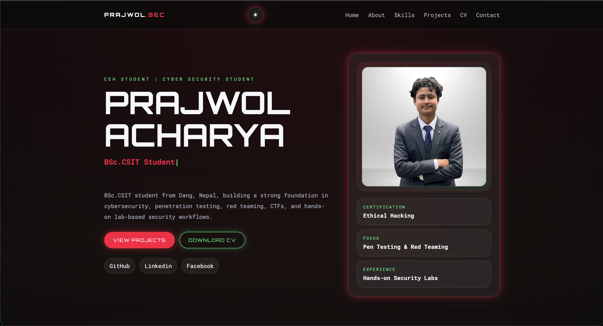

  

<h1 align="center">Prajwol Acharya – Cybersecurity Portfolio</h1>

  <a href="https://prajwolacharya1.com.np">Visit Portfolio Website</a>

---

## Overview

This repository is a showcase of my personal portfolio website.

The portfolio highlights my work, skills, and ongoing learning in the field of cybersecurity. It serves as a central platform where I present my projects, technical abilities, and progress as I continue to grow in this domain.

---

## About Me

I am Prajwol Acharya, a BSc.CSIT student from Nepal with a strong interest in cybersecurity. My focus areas include ethical hacking, penetration testing, red teaming, and hands-on security labs.

---

## Focus Areas

* Ethical Hacking
* Penetration Testing
* Red Teaming
* Capture The Flag (CTF) Challenges
* Practical Security Labs

---

## Featured Work

**Password Strength Checker**
A project focused on evaluating password security based on complexity and best practices.

**Port Scanner**
A foundational project to understand network reconnaissance and service detection.

**CTF Practice & Writeups**
Ongoing work involving challenges in web exploitation, packet analysis, and privilege escalation.

---

## Purpose

This repository is intended to present my portfolio and document my journey in cybersecurity. The source code is not included here, as this repository is meant for informational and showcase purposes only.

---

## Live Website

https://prajwolacharya1.com.np

---

## Connect With Me

* LinkedIn: https://www.linkedin.com/in/prajwol-acharya
* GitHub: https://github.com/prajwolacharyaa

---

**Thank you for visiting.**
